# [Google MediaPipe](https://github.com/google/mediapipe) for Pose Estimation

[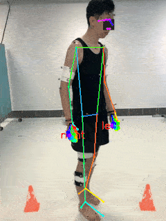](https://www.nature.com/articles/s41597-020-00627-7?sf237508323=1)

[MediaPipe](https://opensource.google/projects/mediapipe) is a cross-platform framework for building multimodal applied machine learning pipelines including inference models and media processing functions.

The main purpose of this repo is to:
* Customize output of MediaPipe solutions
* Customize visualization of 2D & 3D outputs
* Demo some simple applications on Python (refer to [Demo Overview](#demo-overview))
* Demo some simple applications on JavaScript refer to [java](java/) folder


## Pose Estimation with Input Color Image
Attractiveness of Google MediaPipe as compared to other SOTA (e.g. [FrankMocap](https://github.com/facebookresearch/frankmocap), [CMU OpenPose](https://github.com/CMU-Perceptual-Computing-Lab/openpose), [DeepPoseKit](https://github.com/jgraving/DeepPoseKit), [DeepLabCut](https://github.com/DeepLabCut/DeepLabCut), [MinimalHand](https://github.com/CalciferZh/minimal-hand)):
* **Fast**: Runs at almost realtime rate on CPU and even mobile devices
* **Open-source**: Codes are freely available at [github](https://github.com/google/mediapipe) (except that [details of network models are not released](https://github.com/google/mediapipe/issues/155))
* **User-friendly**: For python API just `pip install mediapipe` will work (but C++ API is much more troublesome to [build and use](https://google.github.io/mediapipe/getting_started/cpp))
* **Cross-platform**: Works across Android, iOS, desktop, [JavaScript](https://google.github.io/mediapipe/getting_started/javascript.html) and [web](https://developers.googleblog.com/2020/01/mediapipe-on-web.html) (Note: this repo only focuses on using Python API for desktop usage)
* **ML Solutions**: Apart from face, hand, body and object pose estimations, MediaPipe offers an array of machine learning applications refer to their [github](https://github.com/google/mediapipe) for more details

## Features
Latest [MediaPipe Python API version 0.8.9.1](https://pypi.org/project/mediapipe/) (Released 14 Dec 2021) features:

**Face Detect** (**2D** face detection)

* [**Code**](https://google.github.io/mediapipe/solutions/face_detection) | [**Paper**](https://arxiv.org/abs/1907.05047) |  [**Presentation**](https://docs.google.com/presentation/d/1YCtASfnYyZtH-41QvnW5iZxELFnf0MF-pPWSLGj8yjQ/present?slide=id.g5bc8aeffdd_1_0) | [**Model Card**](https://drive.google.com/file/d/1d4-xJP9PVzOvMBDgIjz6NhvpnlG9_i0S/preview) | [**Model Card**](https://drive.google.com/file/d/1jpQt8TB1nMFQ49VSSBKdNEdQOygNRvCP/preview)

**Face Mesh** (468/478 **3D** face landmarks)

* [**Blog**](https://ai.googleblog.com/2019/03/real-time-ar-self-expression-with.html) | [**Code**](https://google.github.io/mediapipe/solutions/face_mesh) | [**Paper**](https://arxiv.org/abs/1907.06724) |  [**Video**](https://www.youtube.com/watch?v=JNSXC3E0-s4) | [**Model Card**](https://drive.google.com/file/d/1QvwWNfFoweGVjsXF3DXzcrCnz-mx-Lha/view)

**Hands** (21 **3D** landmarks and able to support multiple hands, 2 levels of model complexity) **(NEW world coordinates)**

* [**Blog**](https://ai.googleblog.com/2019/08/on-device-real-time-hand-tracking-with.html) | [**Code**](https://google.github.io/mediapipe/solutions/hands) | [**Paper**](https://arxiv.org/abs/2006.10214) |  [**Video**](https://www.youtube.com/watch?v=I-UOrvxxXEk) | [**Model Card**](https://drive.google.com/file/d/1yiPfkhb4hSbXJZaSq9vDmhz24XVZmxpL/view)

**Body Pose** (33 **3D** landmarks for whole body, 3 levels of model complexity)

* [**Blog**](https://ai.googleblog.com/2020/08/on-device-real-time-body-pose-tracking.html) | [**Code**](https://google.github.io/mediapipe/solutions/pose) | [**Paper**](https://arxiv.org/abs/2006.10204) |  [**Video**](https://www.youtube.com/watch?v=YPpUOTRn5tA&feature=emb_logo) | [**Model Card**](https://drive.google.com/file/d/1zhYyUXhQrb_Gp0lKUFv1ADT3OCxGEQHS/view)

**Holistic (Face + Hands + Body)** (A total of 543/535 landmarks: 468 face + 2 x 21 hands + 33/25 pose)

* [**Blog**](https://ai.googleblog.com/2020/12/mediapipe-holistic-simultaneous-face.html) | [**Code**](https://google.github.io/mediapipe/solutions/holistic#smooth_landmarks)

**Objectron (3D object detection and tracking)** (4 possible objects: Shoe / Chair / Camera / Cup)

* [**Blog**](https://ai.googleblog.com/2020/03/real-time-3d-object-detection-on-mobile.html) | [**Code**](https://google.github.io/mediapipe/solutions/objectron) | [**Paper**](https://arxiv.org/abs/2003.03522) | [**Paper**](https://drive.google.com/file/d/1O_zHmlgXIzAdKljp20U_JUkEHOGG52R8/view) | [**Model Card**](https://drive.google.com/file/d/1CMhN7Npdq0Dt2j0_z69mai2-m7oUTRKF/view)

**Selfie Segmentation** (Segments human for selfie effect/video conferencing)

* [**Blog**](https://ai.googleblog.com/2020/10/background-features-in-google-meet.html) | [**Code**](https://google.github.io/mediapipe/solutions/selfie_segmentation) | [**Model Card**](https://drive.google.com/file/d/1dCfozqknMa068vVsO2j_1FgZkW_e3VWv/preview)

Note: The above videos are presented at [CVPR 2020 Fourth Workshop on Computer Vision for AR/VR](https://xr.cornell.edu/workshop/2020/papers), interested reader can refer to the link for other related works.


## Installation
The simplest way to run our implementation is to use [anaconda](https://www.anaconda.com/).

You can create an anaconda environment called `mp` with
```
conda env create -f environment.yaml
conda activate mp
```

## Demo Overview
<!-- Link to create gif from images https://ezgif.com/maker -->

| Single Image | Video Input | Gesture Recognition | Rock Paper Scissor Game |
| ------------ | ----------- | ------------------- | ----------------------- |
| 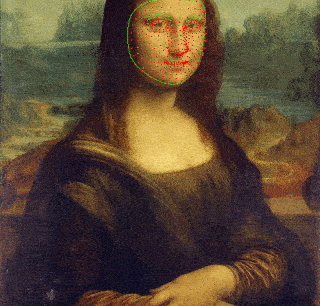 | <a href="http://www.youtube.com/watch?feature=player_embedded&v=rqFp-ZH5tpo" target="_blank"></a> | 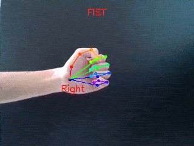 | 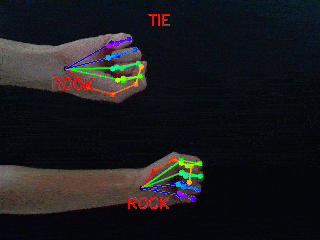 

| Measure Hand ROM | Measure Wrist and Forearm ROM | Face Mask | Triangulate Points for 3D Pose |
| ---------------- | ----------------------------- | --------- | ------------------------------ |
| 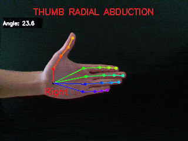 | 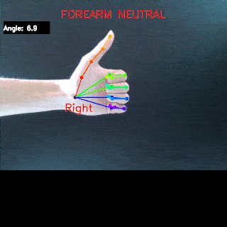| 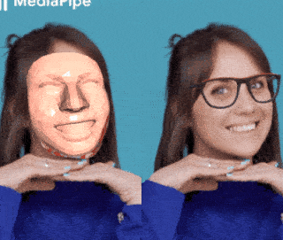 | 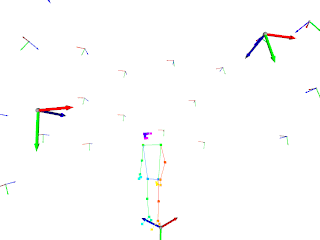 |

| 3D Skeleton | 3D Object Detection | Selfie Segmentation |
| ----------- | ------------------- | ------------------- |
| 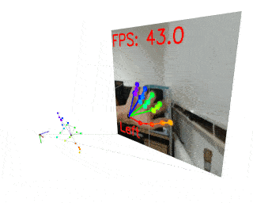 | 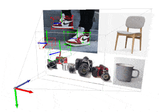| 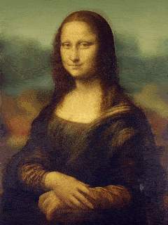|

<!-- [](https://www.youtube.com/watch?v=rqFp-ZH5tpo) --> 

## Usage
### [0. Single Image](code/00_image.py)

5 different modes are available and sample images are located in [data/sample/](data/sample/) folder
```
python 00_image.py --mode face_detect
python 00_image.py --mode face
python 00_image.py --mode hand
python 00_image.py --mode body
python 00_image.py --mode holistic
```
Note: The sample images for subject with body marker are adapted from [An Asian-centric human movement database capturing activities of daily living](https://www.nature.com/articles/s41597-020-00627-7?sf237508323=1) and the image of Mona Lisa is adapted from [Wiki](https://upload.wikimedia.org/wikipedia/commons/e/ec/Mona_Lisa%2C_by_Leonardo_da_Vinci%2C_from_C2RMF_retouched.jpg)


### [1. Video Input](code/01_video.py)

5 different modes are available and video capture can be done online through webcam or offline from your own .mp4 file
```
python 01_video.py --mode face_detect
python 01_video.py --mode face
python 01_video.py --mode hand
python 01_video.py --mode body
python 01_video.py --mode holistic
```

Note: It takes around 10 to 30 FPS on CPU, depending on the mode selected. The [video](https://www.youtube.com/watch?v=rqFp-ZH5tpo) demonstrating supported mini-squats is adapted from [National Stroke Association](https://www.youtube.com/watch?v=WLjOoQUgWs4)


### [2. Gesture Recognition](code/02_gesture.py)

2 modes are available: Use evaluation mode to perform recognition of 11 gestures and use train mode to log your own training data
```
python 02_gesture.py --mode eval
python 02_gesture.py --mode train
```

Note: A simple but effective K-nearest neighbor (KNN) algorithm is used as the classifier. For the hand gesture recognition demo, since 3D hand joints are available, we can compute flexion joint angles (feature vector) and use it to classify different hand poses. On the other hand, if 3D body joints are not yet reliable, the normalized pairwise distances between predifined lists of joints as described in [MediaPipe Pose Classification](https://google.github.io/mediapipe/solutions/pose_classification.html) could also be used as the feature vector for KNN.


### [3. Rock Paper Scissor Game](code/03_game_rps.py)

Simple game of rock paper scissor requires a pair of hands facing the camera
```
python 03_game_rps.py
```
For another game of flappy bird refer to this [github](https://github.com/limgm/flappy-mediapipe)


### [4. Measure Hand Range of Motion](code/04_hand_rom.py)

2 modes are available: Use evaluation mode to perform hand ROM recognition and use train mode to log your own training data
```
python 04_hand_rom.py --mode eval
python 04_hand_rom.py --mode train
```

### [5. Measure Wrist and Forearm Range of Motion](code/05_wrist_rom.py)

3 modes are available and user has to input the side of the hand to be measured
* 0: Wrist flexion/extension
* 1: Wrist radial/ulnar deviation
* 2: Forearm pronation/supination

```
python 05_wrist_rom.py --mode 0 --side right
python 05_wrist_rom.py --mode 1 --side right
python 05_wrist_rom.py --mode 2 --side right
python 05_wrist_rom.py --mode 0 --side left
python 05_wrist_rom.py --mode 1 --side left
python 05_wrist_rom.py --mode 2 --side left
```

Note: For measuring forearm pronation/supination, the camera has to be placed at the same level as the hand such that palmar side of the hand is directly facing camera. For measuring wrist ROM, the camera has to be placed such that upper body of the subject is visible, refer to examples of wrist_XXX.png images in [data/sample/](data/sample/) folder. The wrist images are adapted from [Goni Wrist Flexion, Extension, Radial & Ulnar Deviation](https://www.youtube.com/watch?v=nIPaGkDh3dI) 

### [6. Face Mask](code/06_face_mask.py)

Overlay a 3D face mask on the detected face in image plane
```
python 06_face_mask.py
```
Note: The face image is adapted from [MediaPipe 3D Face Transform](https://developers.googleblog.com/2020/09/mediapipe-3d-face-transform.html)


### [7. Triangulate Points](code/07_triangulate.py)

Estimating 3D body pose from a single 2D image is an ill-posed problem and extremely challenging.
One way to reconstruct 3D body pose is to make use of multiview setup and perform triangulation.
For offline testing, use [CMU Panoptic Dataset](http://domedb.perception.cs.cmu.edu/171204_pose1.html), follow the instructions on [PanopticStudio Toolbox](https://github.com/CMU-Perceptual-Computing-Lab/panoptic-toolbox) to download a sample dataset 171204_pose1_sample into data/ folder
```
python 07_triangulate.py --mode body --use_panoptic_dataset
```

<!-- For online testing, make sure camera intrinsics and extrinsics parameters are available, if not refer to [utils_3d_reconstruction.py](code/utils_3d_reconstruction.py) for more details
```
python 07_triangulate.py --mode hand
python 07_triangulate.py --mode body
python 07_triangulate.py --mode holistic
``` -->

### [8. 3D Skeleton](code/08_skeleton_3D.py)

3D pose estimation is available in full-body mode and this demo displays the estimated 3D skeleton of the hand and/or body. 3 different modes are available and video capture can be done online through [webcam](https://github.com/ntu-rris/google-mediapipe/blob/990a4a73c969450f6414940af5a832c7820f5c01/code/08_skeleton_3D.py#L24) or offline from your own [.mp4 file](https://github.com/ntu-rris/google-mediapipe/blob/990a4a73c969450f6414940af5a832c7820f5c01/code/08_skeleton_3D.py#L25)

```
python 08_skeleton_3D.py --mode hand
python 08_skeleton_3D.py --mode body
python 08_skeleton_3D.py --mode holistic
```


### [9. 3D Object Detection](code/09_objectron.py)

4 different modes are available and a sample image is located in [data/sample/](data/sample/) folder. Currently supports 4 classes: Shoe / Chair / Cup / Camera.

```
python 09_objectron.py --mode shoe
python 09_objectron.py --mode chair
python 09_objectron.py --mode cup
python 09_objectron.py --mode camera
```


### [10. Selfie Segmentation](code/10_segmentation.py)

2 modes are available. The landscape mode has fewer FLOPS than the general model and may run faster. The selfie segmentation works best for selfie effects and video conferencing, where the person is close (< 2m) to the camera.

```
python 10_segmentation.py --mode general
python 10_segmentation.py --mode landscape
```


## Limitations:
Estimating 3D pose from a single 2D image is an ill-posed problem and extremely challenging, thus the measurement of ROM may not be accurate!
Please refer to the respective model cards for more details on other types of limitations such as lighting, motion blur, occlusions, image resolution, etc.
