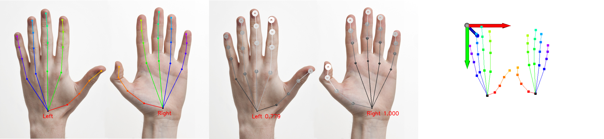
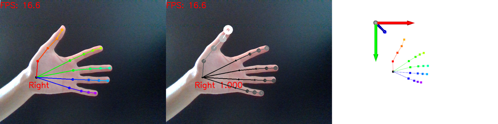
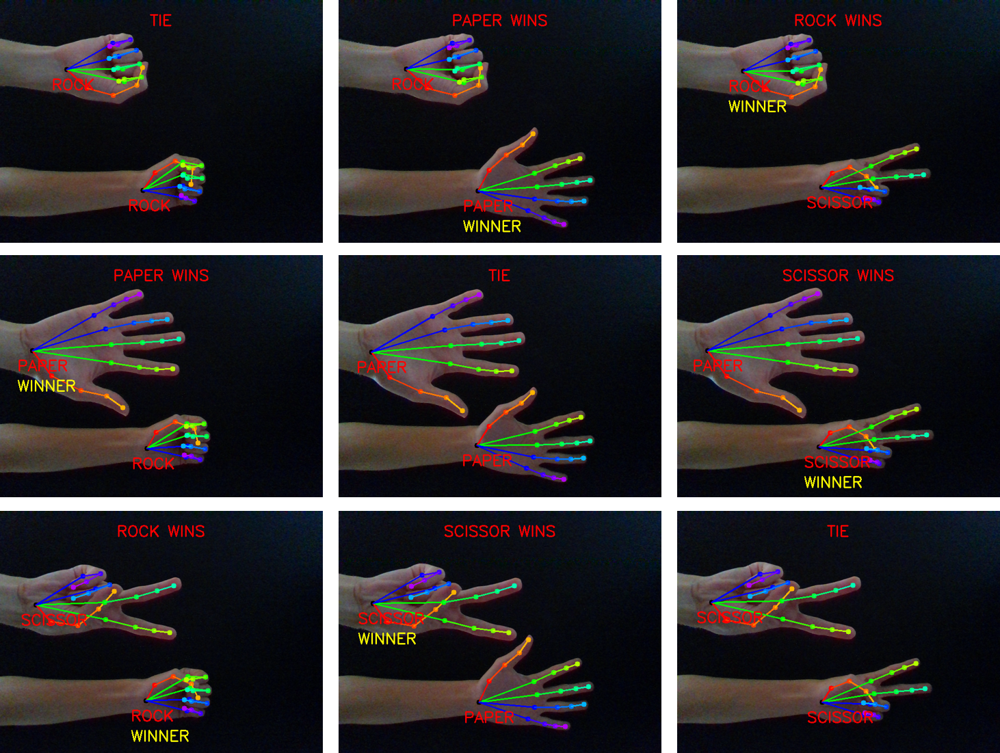
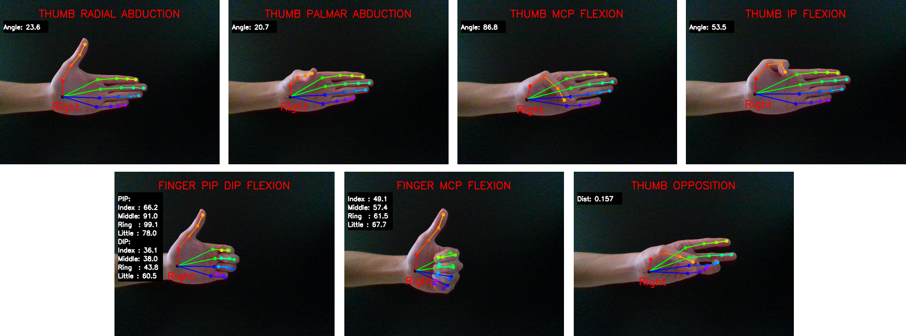
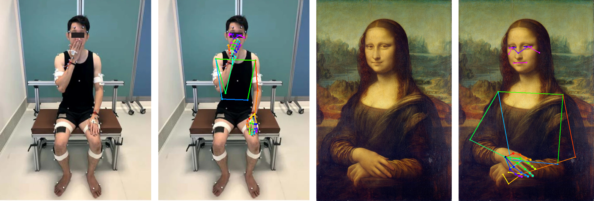

# [Google MediaPipe](https://github.com/google/mediapipe)

[MediaPipe](https://opensource.google/projects/mediapipe) is a cross-platform framework for building multimodal applied machine learning pipelines including inference models and media processing functions.

The main purpose of this repo is to:
* Customize output of MediaPipe solutions
* Customize visualization of 2D & 3D outputs
* Demo some simple applications with hand tracking 
	* [Gesture recognition](code/02_gesture.py)
	* [Game of rock paper scissor ](code/03_game_rps.py)
	* [Measure hand range of motion](code/04_hand_rom.py)
	* [Articulate 3D hand mesh model]()
* Demo some simple applications with body tracking
	* Measure body range of motion
	* 3D body pose with stereo vision
	* Articulate 3D human mesh model

## Pose Estimation from Color Image
Attractiveness of Google MediaPipe as compared to other SOTA (e.g. [CMU OpenPose](https://github.com/CMU-Perceptual-Computing-Lab/openpose), [DeepPoseKit](https://github.com/jgraving/DeepPoseKit), [DeepLabCut](https://github.com/DeepLabCut/DeepLabCut), [MinimalHand](https://github.com/CalciferZh/minimal-hand)):
* **Fast** Runs at almost realtime rate on CPU and even mobile devices
* **Open-source** Codes are freely available at [github](https://github.com/google/mediapipe) (except that [details of network models are not released](https://github.com/google/mediapipe/issues/155))
* **User-friendly** For python API just `pip install mediapipe` will works (but C++ API is much more troublesome to [build and use](https://google.github.io/mediapipe/getting_started/cpp))
* **Cross-platform** Works across Android, iOS, desktop and [web](https://developers.googleblog.com/2020/01/mediapipe-on-web.html) (Note: this repo only focuses on using Python API for desktop usage)
* **ML Solutions** Apart from face, hand and body pose estimations, MediaPipe offers an array of machine learning applications refer to their [github](https://github.com/google/mediapipe) for more details

Latest [MediaPipe Python API version 0.8.1](https://pypi.org/project/mediapipe/) (Released 10 Dec 2020) features:

### Face Mesh 
468 **3D** face landmarks

[**Blog**](https://ai.googleblog.com/2019/03/real-time-ar-self-expression-with.html) | [**Code**](https://google.github.io/mediapipe/solutions/face_mesh) | [**Paper**](https://arxiv.org/abs/1907.06724) |  [**Video**](https://www.youtube.com/watch?v=JNSXC3E0-s4) | [**Model Card**](https://drive.google.com/file/d/1QvwWNfFoweGVjsXF3DXzcrCnz-mx-Lha/view)

### Hands
21 **3D** landmarks and able to support multiple hands

[**Blog**](https://ai.googleblog.com/2019/08/on-device-real-time-hand-tracking-with.html) | [**Code**](https://google.github.io/mediapipe/solutions/hands) | [**Paper**](https://arxiv.org/abs/2006.10214) |  [**Video**](https://www.youtube.com/watch?v=I-UOrvxxXEk) | [**Model Card**](https://drive.google.com/file/d/1yiPfkhb4hSbXJZaSq9vDmhz24XVZmxpL/view)

### Body Pose
33 **2D** landmarks for whole body / 25 **2D** landmarks for upper-body

[**Blog**](https://ai.googleblog.com/2020/08/on-device-real-time-body-pose-tracking.html) | [**Code**](https://google.github.io/mediapipe/solutions/pose) | [**Paper**](https://arxiv.org/abs/2006.10204) |  [**Video**](https://www.youtube.com/watch?v=YPpUOTRn5tA&feature=emb_logo) | [**Model Card**](https://drive.google.com/file/d/1zhYyUXhQrb_Gp0lKUFv1ADT3OCxGEQHS/view)

### Holistic (Face + Hands + Body)
A total of 543/535 landmarks (468 face + 2 x 21 hands + 33/25 pose)

[**Blog**](https://ai.googleblog.com/2020/12/mediapipe-holistic-simultaneous-face.html) | [**Code**](https://google.github.io/mediapipe/solutions/holistic#smooth_landmarks)

Note: The above videos are presented at [CVPR 2020 Fourth Workshop on Computer Vision for AR/VR](https://xr.cornell.edu/workshop/2020/papers), interested reader can refer to the link for other related works.


## Installation
The simplest way to run our implementation is to use [anaconda](https://www.anaconda.com/).

You can create an anaconda environment called `mp` with
```
conda env create -f environment.yaml
conda activate mp
```


## Usage
* [00_image](code/00_image.py): Test with single image


* [01_video](code/01_video.py): Test with video input (Note: it takes around 15 FPS on CPU)



## Demo
* [02_gesture](code/02_gesture.py): Simple recognition of 11 gestures


* [03_game_rps](code/03_game_rps.py): Simple game of rock paper scissor


* [04_hand_rom](code/04_hand_rom.py): Measuring hand range of motion (ROM)


* [05_hand_body](code/05_hand_body.py): Test with single image of upper body to detect both upper body and hand joints (Note: the image for subject with body marker is adapted from [An Asian-centric human movement database capturing activities of daily living](https://www.nature.com/articles/s41597-020-00627-7?sf237508323=1) and the image of Mona Lisa is adapted from [Wiki](https://upload.wikimedia.org/wikipedia/commons/e/ec/Mona_Lisa%2C_by_Leonardo_da_Vinci%2C_from_C2RMF_retouched.jpg))


* [06_hand_body_video](code/06_hand_body_video.py): Test with video input to detect both upper body and hand joints (Note: the video is adapted from [Fugl-Meyer Assessment of Motor Recovery after Stroke](https://www.youtube.com/watch?v=B70qDfl3LyA&gl=SG))
Click on the image below to view the video on YouTube:

[](https://www.youtube.com/watch?v=pxVj8oB-g-w)


## Limitations:
Estimating 3D hand pose from a single 2D image is an ill-posed problem and extremely challenging, thus the resulting hand ROM may not be accurate!
Please refer to the respective model cards for more details on other types of limitations such as lighting, motion blur, occlusions, image resolution, etc.
